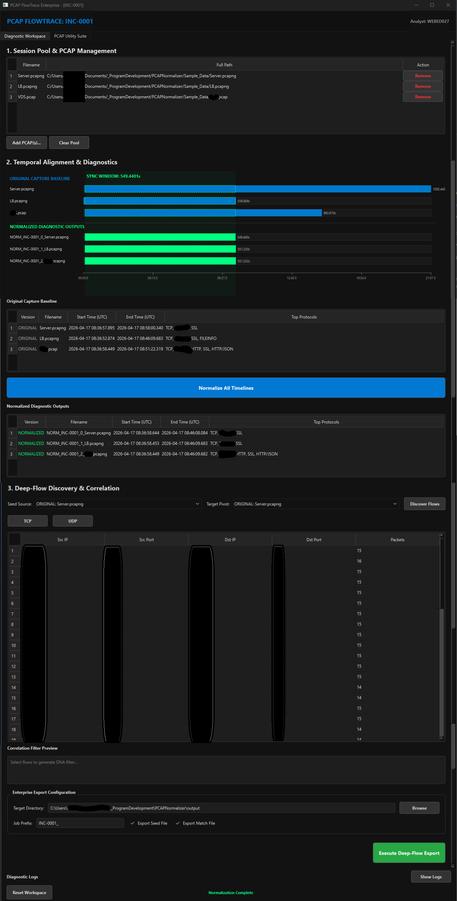
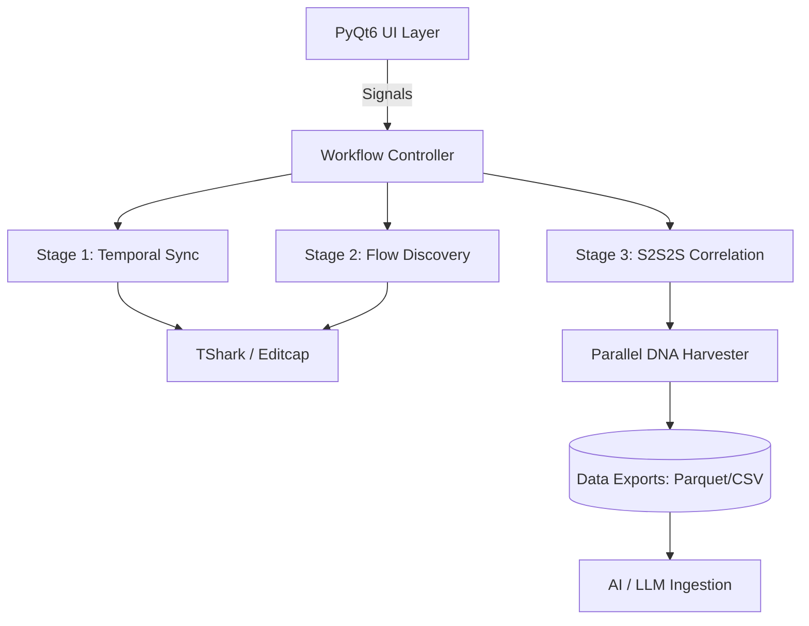
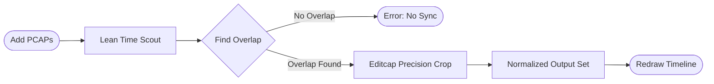
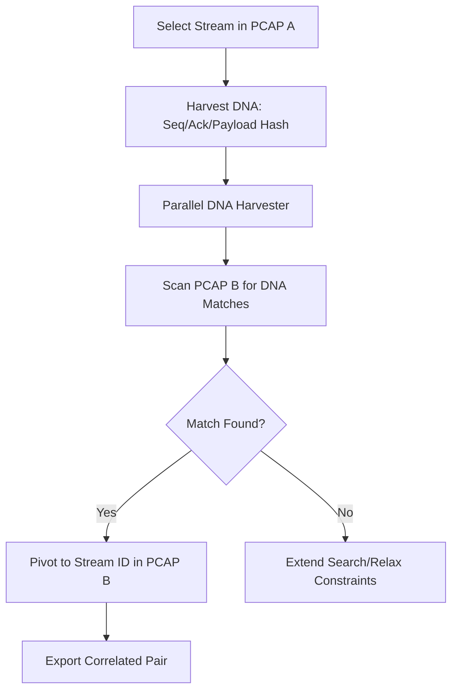

# PCAP FlowTrace Enterprise
### The Ultimate Multi-Hop Forensic Normalizer & AI-Bridge

[](https://www.python.org/)
[](https://riverbankcomputing.com/software/pyqt/)
[](https://www.wireshark.org/)
[](https://opensource.org/licenses/MIT)



## The Mission: Ending the Multi-Hop Headache
Network forensics in complex environments is a challenge. When traffic traverses Load Balancers, Firewalls, and VDS nodes, packets get mangled, timestamps drift, and IPs change. 

PCAP FlowTrace Enterprise is built to solve this. It doesn't just read packets; it normalizes them into a single, synchronized story, ready for human analysis or AI ingestion.

---

## Core Capabilities

### 1. N-Way Temporal Alignment (Stage 1)
Identifies the shared temporal window across multiple capture files.
- **Auto-Sync Engine:** Automatically identifies the shared Sync Window.
- **Precision Cropping:** Uses `editcap` to millisecond-align every PCAP.
- **Visual Mapping:** A custom `TimelineWidget` that visualizes the Temporal Overlap.

### 2. Deep-Flow Correlation: S2S2S (Stage 2)
Track a conversation across the void between network hops.
- **Packet DNA Matching:** Uses unique TCP/UDP payload hashes and sequence numbers to match flows.
- **Absolute Reconstruction:** Link client-side requests directly to server-side responses.

### 3. The AI Bridge (LLM Readiness)
Optimizes network data for Large Language Models.
- **Apache Parquet Support:** Converts heavy PCAPs into high-speed, compressed columnar data.
- **AI Token Counter:** Built-in `tiktoken` integration to estimate forensic data cost.
- **Context Optimization:** Extracts only necessary fields to keep context windows lean.

---

## Architecture: Forensic-Grade Design

The application follows a Modular Forensic Architecture to ensure UI responsiveness during heavy processing.

### High-Level System Flow


### Stage 1: Temporal Alignment Logic


### Stage 2: S2S2S Correlation Workflow


---

## Technical Implementation

### The Engine Room
*   **Asynchronous Processing:** Every forensic task runs in its own `QThread`.
*   **Multiprocessing:** The DNA Harvester utilizes all available CPU cores in parallel.
*   **Lean Discovery:** Scouts protocols using Pass 0 logic to minimize RAM usage.

### Project Anatomy

| File | Responsibility |
| :--- | :--- |
| `main.py` | The UI Orchestrator & Entry Point. |
| `engine_logic.py` | The Brain—Threads, Workers, and Forensic Orchestration. |
| `dashboard_view.py`| The Diagnostic Workspace (Main Command Center). |
| `utilities_view.py`| The Utility Suite (Merge, Extract, Query, AI Tools). |
| `utils.py` | Low-level Wireshark & TShark wrappers. |
| `widgets.py` | Custom UI components like the Dynamic Timeline. |
| `config_manager.py`| Binary path discovery and environment validation. |

---

## Getting Started

### 1. Requirements
*   Windows 10/11
*   Wireshark Installed (Must be in PATH or default locations)
*   Python 3.9+

### 2. Setup
```bash
# Clone and enter
git clone https://github.com/youruser/PCAPNormalizer.git
cd PCAPNormalizer

# Install forensic dependencies
pip install -r requirements.txt

# Launch Workspace
python main.py
```

### 3. Build Executable
```bash
python build_dist.py
```

---

## Contributing
Submit a PR to add forensic fields to the `MASTER_FORENSIC_MAP` or to report issues.

## License
MIT License

---
*Created for Network Engineers and Forensic Analysts.*
